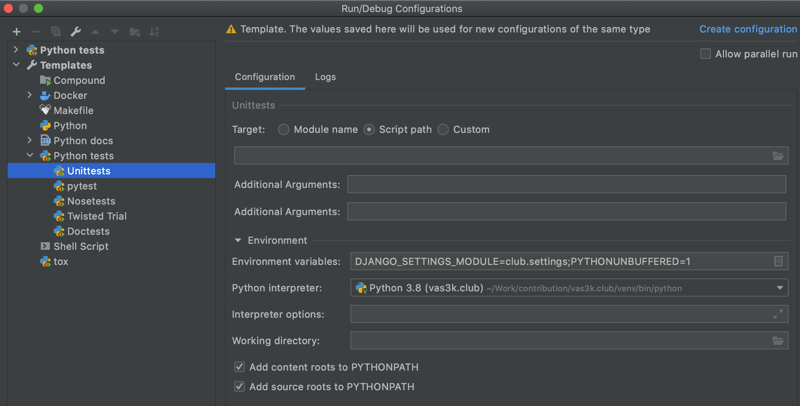

# Testing

## Prerequisites

Consider next required conditions for running tests:

- **venv**

  Don't forget to run it under configured venv. Look [setup venv](#setup-venv) how to configure venv
- **postgres**

  Due to tests make database queries the local postgres should be running. 
  
  Run postgres:
  ```sh
  $ docker-compose -f docker-compose.yml up -d postgres
  ```
  For first time run migrations (it needs only for fresh images) 
  ```sh 
  (venv) $ ./manage.py migrate
  ```
- **redis**
  Run redis:
  ```sh
  $ docker-compose -f docker-compose.yml up -d redis
  ```
- build **frontend**
  
  For [views tests](https://docs.djangoproject.com/en/3.1/intro/tutorial05/#a-test-for-a-view) its essential to build our frontend upfront. 
  Hot to build front look [setup-frontend](#setup-frontend) section, for now just run next commands:
  ```sh
  $ cd frontend
  $ npm ci # or npm install
  $ npm run build
  ```
  Above commands will create [required `webpack-stats.json`](https://github.com/rustockholm/rustockholm.club/blob/6f1812f36b546feba2bd729ac84011e20e237136/club/settings.py#L228) file
- test environment variables
  ```dotenv
  DJANGO_SETTINGS_MODULE=club.settings;
  PYTHONUNBUFFERED=1;
  TESTS_RUN=da
  POSTGRES_DB=rustockholm_club
  POSTGRES_USER=postgres
  POSTGRES_PASSWORD=postgres
  POSTGRES_HOST=localhost
  REDIS_DB=0
  REDIS_HOST=localhost
  ```

## Run tests

Basically tests automatically runs in CI in opened PR, but if you want to run tests **locally** there are few ways to do it
1. virgin shell
   ```sh
   $ make test
   ```
2. venv shell
   ```sh
   $ source {your-venv-folder}/bin/activate
   (venv) $ ./manage.py test
   ```
   (^*don't forget inject test env variables*)
3. pycharm *profession edition*
   Use `django tests` template out of the box
4. pycharm *common edition*
   - Make sure you have set `Unittest` as default test runner: Settings --> Tools --> Python Integrated Tools --> Default Test Runner: Unittests
   
   - In Run/Debug Configuration put environment variables from [prerequisites](#Prerequisites)
     
   - For workaround *"django.core.exceptions.AppRegistryNotReady: Apps aren't loaded yet."* add this lines to test file before importing models:
     ```python
     import django
     django.setup()
     ```

For more information about testing in django look well written [official documentation](https://docs.djangoproject.com/en/3.1/topics/testing/overview/)
